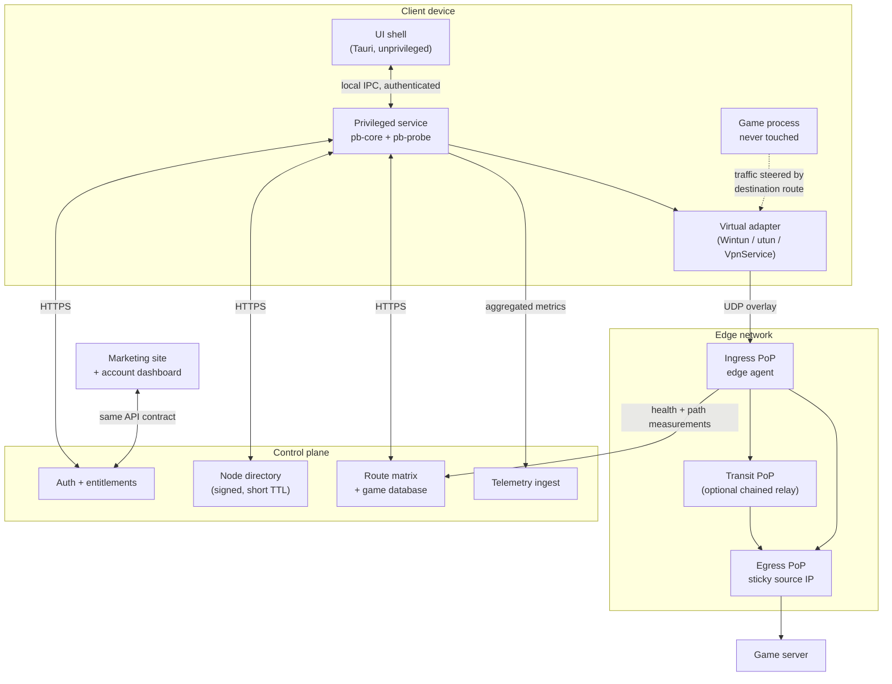

# 00 — System overview

## What we are actually building

Three things, in descending order of how much they determine success:

1. **A measured overlay network.** A modest set of well-placed relay PoPs, continuously
   measuring the paths between themselves and between themselves and real game servers.
2. **A route selection engine.** The thing that decides, per user per game per moment,
   which path to use — and whether to use one at all.
3. **Client applications.** Thin shells that apply the decision and show the user
   honest numbers.

Most teams build these in reverse order, ship a beautiful client with a fake ping
graph, and then discover they have no product. The layout of this repository is
deliberately arranged to prevent that.

## Why acceleration works at all

The naive objection is: "you're adding a hop, so latency must increase." Sometimes it
does — and when it does, we say so and get out of the way (see *The honesty principle*
below). But there are structural reasons a longer overlay path routinely beats the
default one:

- **Consumer ISPs buy cheap transit.** Their BGP choice optimises for *their* cost, not
  your latency. International routes are especially bad — traffic from Southeast Asia to
  Europe may transit via North America because that's where the cheap peering is.
- **Congestion and bufferbloat are path-specific.** A congested peering point adds tens
  of milliseconds of queuing delay. A different path skips it entirely.
- **Packet loss is path-specific and mostly not random.** It clusters on specific
  overloaded links. Two disjoint paths rarely drop the same packet.
- **BGP has no idea about latency.** It counts AS hops. It cannot see that one path has
  40 ms of jitter and the other has 2 ms.

So the mechanism is: get the player's game traffic onto a well-provisioned network as
close to the player as possible, then carry it to the game server over paths we have
actually measured. The win comes from measurement and provisioning, not from magic.

## Component map

Note what the diagram does *not* contain: any arrow from our software into the game
process. That absence is a design requirement, not an omission. See
[`06-anti-cheat-and-trust.md`](06-anti-cheat-and-trust.md).

## The honesty principle

**If we cannot beat the direct path, we say so and disable ourselves for that route.**

This sounds like giving up revenue. It is the opposite. Consider a player in Frankfurt
playing on a Frankfurt game server: their direct RTT is 8 ms and nothing we do will
improve it. A competitor's client shows a made-up "optimised" number, the player's ping
doesn't change, and they cancel in month one. Ours says *"your connection to this server
is already optimal — acceleration is off"* and shows the measurement that proves it.

Concretely this means the client always maintains a **baseline measurement of the direct
path** alongside the candidate overlay paths, and the comparison is surfaced in the UI.
The route scoring engine treats "direct" as just another candidate path that must win on
merit (`pb-probe`, `PathKind::Direct`).

Two consequences worth stating explicitly:

- It makes the product defensible. "We measure and we show you" is a claim competitors
  who fake their numbers cannot match.
- It shapes marketing. We sell to players whose routes we *can* improve — which is a
  targetable segment (high international RTT, high loss) rather than everyone.

## Where the difficulty actually is

Ranked by how likely each is to sink the schedule:

| Risk | Why it bites | Mitigation |
|---|---|---|
| Windows code signing lead time | Unsigned installers get SmartScreen-blocked; certs need hardware tokens and org validation | Start procurement in week 1, before any code. See [`02-windows-client.md`](02-windows-client.md) |
| Anti-cheat false positives | One ban wave ends the company | Network-layer only, no injection, proactive vendor contact. [`06`](06-anti-cheat-and-trust.md) |
| Game server IP database | Split tunnelling by destination needs to know where game servers are | Build the observation pipeline early; it is the moat. [`03`](03-control-plane.md) |
| Sticky egress under route change | Naive route switching drops players mid-match | Designed in from the start. [`01`](01-data-plane.md) |
| Billing/entitlement reconciliation | Stripe + Apple IAP + Google IAP diverge and users lose access they paid for | One normalised entitlement record. [`03`](03-control-plane.md) |

## Reading order

1. [`01-data-plane.md`](01-data-plane.md) — the acceleration mechanism
2. [`02-windows-client.md`](02-windows-client.md) — first shipping client
3. [`04-edge-network.md`](04-edge-network.md) — what the client connects to
4. [`03-control-plane.md`](03-control-plane.md) — the services behind both
5. [`06-anti-cheat-and-trust.md`](06-anti-cheat-and-trust.md) — constraints that shaped all of the above
6. [`05-rewards-and-drops.md`](05-rewards-and-drops.md) — growth mechanics, including the Twitch question
