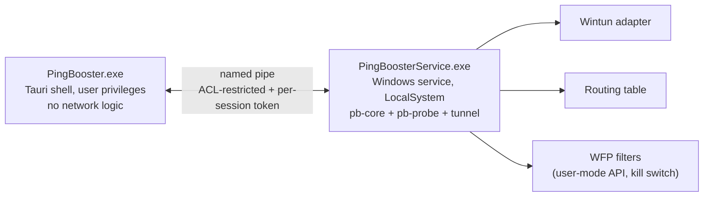

# 02 — The Windows client

Windows ships first: highest ARPU, and it's where the competition makes its money. It is
also the platform with the most ways to lose weeks, so this document is mostly about
avoiding those.

## Process architecture

Two processes, not one.

The UI runs unprivileged and contains no networking code. Creating a virtual adapter and
editing the routing table needs administrator rights, so that work lives in a service
installed once at setup time. This is the same split WireGuard and Tailscale use, and it
exists for a specific reason: **an application that requires the user to run the whole UI
as administrator is one exploited renderer away from full system compromise.** A Tauri
webview rendering remote content must never hold those privileges.

The IPC channel is a named pipe with an ACL restricted to the installing user's SID plus
Administrators, and each UI session authenticates with a token the service issues at
connect time. Do not skip this: an unauthenticated local pipe that can add routes is a
local privilege escalation vulnerability, and security researchers scan for exactly this
pattern in VPN clients.

## The virtual adapter: Wintun

Use [Wintun](https://www.wintun.net/), the userspace TUN driver from the WireGuard
project. It is a layer-3 adapter exposing a simple ring-buffer API, it is well tested at
scale, and — decisively — **the driver binary is signed by WireGuard LLC**. We
redistribute their signed `.sys` rather than authoring and signing a kernel driver
ourselves.

That single choice eliminates the largest schedule risk on this platform. Authoring our
own kernel-mode driver would require an EV certificate, a Microsoft Partner Center
account, attestation signing submissions, and a re-submission cycle on every driver
change — plus the standing reality that a kernel bug is a bluescreen on a paying
customer's gaming PC. At 150 kbps per user, there is no performance argument that
justifies it. See [ADR 0002](../adr/0002-userspace-tunnel-first.md).

## Split tunnelling by destination, not by process

This is the most important design decision in the client, and it is counterintuitive
enough to be worth spelling out.

The obvious approach to "route only the game's traffic" is per-process interception:
identify the game's socket, redirect its connections. On Windows the supported way to
*redirect* per-process is a **WFP callout driver** operating at the ALE layers, matching
on the process AppId. That means writing a kernel driver — which is exactly what we just
decided to avoid.

The alternative: **select traffic by destination address.** Game servers live at known
addresses. Add routes for those destinations pointing at the Wintun adapter; everything
else follows the default route and is untouched.

For this product that turns out to be *better*, not merely cheaper:

- We need a game-server address database regardless — it is what lets us measure
  path quality to real game servers rather than to our own PoPs. Destination-based
  selection reuses an asset we must build anyway.
- It is inherently robust to how the game launches. Anti-cheat launchers, subprocess
  trees, Epic/Steam relaunching the binary, 32/64-bit shims — none of it matters,
  because we never had to identify a process in the first place.
- It cannot accidentally capture the wrong traffic from a game process. Game clients
  also talk to telemetry, patching and store endpoints; those should *not* be routed
  through our relays, and destination-based selection excludes them for free.
- No kernel driver, therefore no driver signing, therefore no BSOD risk.

The tradeoff is honest: it fails for a game whose servers we haven't catalogued, and for
peer-to-peer games where the "server" is another player at an arbitrary address. Both are
handled by the dynamic learning path below, and the fallback for a genuinely unknown
game is to route its full destination set — which is still narrower than routing the whole
device.

### Populating the address database

Two sources, combined:

1. **Static, shipped as signed config.** Publisher server ranges are well known and
   mostly stable — they sit in identifiable ASNs and announced prefixes. Curated centrally,
   delivered through the hot-updatable config channel, so adding a game needs no client
   release ([`03-control-plane.md`](03-control-plane.md)).
2. **Dynamic observation on the client.** Read the OS's own connection table via
   `GetExtendedUdpTable` / `GetExtendedTcpTable`, which reports owning PID per
   connection. Correlate against the running process list to attribute endpoints to a
   known game executable, and learn the destinations it actually talks to.

To be unambiguous about the second one, because it is the sort of thing that gets
misremembered later: enumerating processes and reading the OS connection table are
ordinary documented Win32 APIs that inspect *operating system* state. That is categorically
different from opening a handle to a game process and reading its memory. We do the
former and never the latter. See [`06-anti-cheat-and-trust.md`](06-anti-cheat-and-trust.md).

Learned endpoints are reported back (as coarse aggregates, never per-user browsing data)
to improve the shared database — the network gets better as it gets more users, which is
the flywheel worth having.

### Routing mechanics and the traps in them

- **Pin the tunnel endpoint.** A `/32` route to the ingress PoP via the *physical*
  interface, installed before the tunnel comes up. Without it, tunnel packets try to
  route through the tunnel and the whole thing deadlocks. This is the classic VPN
  bootstrap bug.
- **Metrics matter.** Game routes need a lower metric than the default route, and the
  adapter's own metric must be set explicitly — Windows' automatic metric assignment will
  otherwise change behaviour depending on the user's NIC speed.
- **Handle IPv6 or block it.** If a game reaches its server over IPv6 and we only
  installed IPv4 routes, traffic silently bypasses acceleration and the user sees no
  improvement. Either accelerate both families or install a WFP block on IPv6 to that
  destination so it falls back to IPv4 deterministically. Silent bypass is the worst
  outcome because it looks like the product doesn't work.
- **Restore state on crash.** Routes and adapters outlive a crashed process. The service
  journals every change it makes and reconciles at startup, and the installer's uninstall
  path removes them. A booster that leaves a broken routing table behind after a crash
  generates support tickets forever.
- **Kill switch via user-mode WFP.** The user-mode WFP API (`fwpuclnt.dll`) can add
  *filter* rules — permit/block — without any kernel driver. Insufficient for redirection,
  perfectly sufficient to block game traffic that would otherwise leak to the direct path
  during a tunnel transition. Note the product default here should be fail-*open* to
  direct rather than fail-closed: for a game booster, a ping spike beats a disconnect.

## Code signing: start this in week one

This is a procurement task with a multi-week tail, and no amount of engineering velocity
compensates for starting it late. An unsigned installer triggers Microsoft Defender
SmartScreen warnings that will destroy the conversion rate on a paid consumer product.

What changed and why it's slower than people expect: since June 2023, CA/Browser Forum
baseline requirements mandate that code signing private keys live on FIPS 140-2 Level 2
(or Common Criteria equivalent) hardware. You can no longer receive a `.pfx` by email.
The options:

| Option | Cost | Lead time | Notes |
|---|---|---|---|
| **Azure Trusted Signing** | ~$10/month | Days, if the org qualifies | Cheapest and fastest. Keys managed in Azure, no hardware token to lose. Requires a verifiable organisation — historically 3+ years of trading history — with an individual tier as an alternative. **Try this first.** |
| OV certificate + hardware token | ~$200–400/yr | 1–3 weeks | Physical token shipped to you. Painful to use in CI; needs a dedicated signing machine or cloud HSM. |
| EV certificate + hardware token | ~$400–700/yr | 2–4 weeks | Historically bought instant SmartScreen reputation; that advantage is much weaker now. Only worth it if a kernel driver is on the roadmap, since driver attestation signing requires EV. |

Recommendation: **Azure Trusted Signing**, and keep the option of an EV certificate in
reserve for if we ever need our own kernel driver. Either way, open the account and start
organisation validation before the first line of installer code — the dependency is
calendar time, not effort.

Reputation also accrues per-certificate and per-binary, so avoid rotating certificates
casually and sign every shipped artefact, including the updater and the service.

## Installer and updates

- **WiX/MSI** for the installer. It handles service installation, upgrade sequencing and
  clean uninstall properly, and it's what enterprise deployment tooling expects. NSIS is
  faster to get running and worse at all three.
- Install the service, register it for automatic start, place the Wintun redistributable,
  and register the uninstall cleanup that removes routes and the adapter.
- **Signed update manifests.** The updater verifies a signature over the manifest with a
  key pinned in the binary, independently of TLS. TLS alone means a compromised or
  mis-issued certificate becomes remote code execution as LocalSystem on every customer
  machine. This is the highest-severity thing in the client; treat the pinned key as the
  crown-jewel secret.
- Staged rollout with a server-side kill switch: percentage-based release, and the
  ability to halt a bad build before it reaches everyone. Given the service runs as
  LocalSystem, "we can stop the rollout" is a safety property, not a convenience.

## "FPS boost", carefully

Competitors advertise an FPS booster. What that actually does is mundane: lower the
priority of background processes, free standby memory, suggest GPU driver and in-game
settings changes. All of that is fine — it stays entirely outside the game process.

The line is absolute and worth restating because this is where a well-meaning
implementation goes wrong: **do not inject a DLL, hook a graphics API, or write to the
game's memory to render an overlay or read a frame counter.** That is
indistinguishable from a cheat to any anti-cheat system. If we want an in-game overlay,
the answer is "we don't ship one", not "we ship a careful one".

Frame-rate data, if we want to display it at all, comes from the OS: ETW providers
(`Microsoft-Windows-DxgKrnl`) expose present timing without touching the target process.

## What ships in v1

- Privileged service + unprivileged Tauri UI, authenticated named-pipe IPC
- Wintun adapter, UDP overlay with QUIC/443 fallback
- Destination-based split tunnelling from signed game database + dynamic learning
- Direct-path baseline measurement and honest comparison in the UI
- Adaptive dual-path duplication
- Signed installer and signed-manifest updater, staged rollout with kill switch

Deferred, deliberately: custom WFP callout driver, per-process selection, console
support, in-game overlay.
